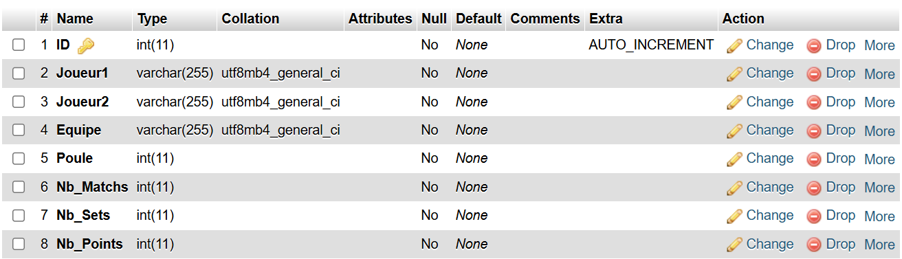
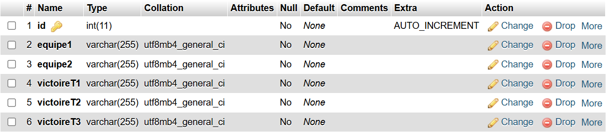
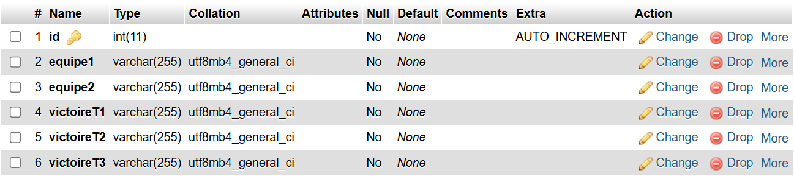

## DOSSIER PROJET
TP – Developpeur Web et Web Mobile

## Le Volant Gatinais

# Explications du projet :

Ce projet a pour but de mettre en place un site web qui permettra à une association sportive de faire des tournois interclubs. Les joueurs pourront alors visualiser en temps réel le suivi du tournois. L'administrateur du tournois pourra alors mettre en place toute la gestion du tournois depuis cette application.

# Objectifs du projet : 

L'objectif de se projet est de montrer les compétences que j'ai acquises tout au long de cette formation. Ce projet permettra également la mise en place d'un site internet dans le but de moderniser et de simplifier les méthodes de gestion de tournois dans l'association "Le Volant Gatinais" pour laquelle je suis bénévole.

## Informations

**Github** : (https://github.com/Arrhess/VolantGatinais)

## Réflexion et configuration de l'environnement de travail

**Résumé du besoin et choix des technologies**

Le Volant Gatinais a besoin d'avoir une application web lui permettant l'automatisation et la gestion des tournois.

Pour cela, un site web sera mis en place, permettant à tous les utilisateurs de visualiser le tournois en temps réel, avec l'affichage des matchs.

Pour le Backend, le langage PHP sera utilisé, ce qui permettra de manier les différentes bases de données avec MySQL.

Pour la partie Frontend, le choix s'est tourné simplement sur une page web HTML avec du CSS.

## Configuration de l'environnement de travail

Travaillant sur un système d'exploitation de type Windows, les informations ci-dessous y seront donc destinées :

- **Serveur:**
    + Apache
    + PHP 8.2
    + MySQL 10.4 / PDO

- **Backend :**
    + PHP 8.2
    + MySQL 8.0 / PDO

- **Frontend :**
    + HTML 5
    + CSS 3
 

## Utilisation et intructions pour deployer en local :

Pour commencer, il faut télécharger et installer le logiciel XAMPP depuis le lien suivant : https://www.apachefriends.org/fr/index.html

Ainsi que MySQL depuis le lien suiant : https://www.postgresql.org/

Une fois ces étapes réalisées, pour accéder au projet en local, il faudra télécharger le dossier ZIP de ce projet depuis le GitHub, dont le lien a été fourni plus haut.  Puis il faudra décompresser le fichier pour accéder à l'ensemble du projet depuis votre bureau.

## Les options de connection à la base de données :

Pour que le projet soit fonctionnel, il faudra faire attention à ce que les paramètres de votre serveur soient compatibles avec le projet. Pour ce faire, il faudra verifier les paramètres suivants depuis le panneau de contrôle XAMPP :

Apache --> Config --> config.inc.php
- **Authentication type and info :**
    + $cfg['Servers'][$i]['auth_type'] = 'config';
    + $cfg['Servers'][$i]['user'] = 'root';
    + $cfg['Servers'][$i]['password'] = '';
    + $cfg['Servers'][$i]['extension'] = 'mysqli';
    + $cfg['Servers'][$i]['AllowNoPassword'] = true;
    + $cfg['Lang'] = '';
    + $cfg['Servers'][$i]['port'] = 3307;
 
Mysql --> Config --> config.inc.php

    Port = 3307

## Création de la base de données en local :

Pour permettre de faire les liens avec la base de données, il faudra donc depuis votre serveur local créer une nouvelle base de données "levolantgatinais_bdd" contenant 3 tables :

**Table "inscriptions" :**

Attention de respecter la nomenclature des différents champs créés dans cette base de données :

+ "ID" --> Type 'INT' AUTO_INCREMENT
+ "Joueur1" --> Type 'VARCHAR (255)'
+ "Joueur2" --> Type 'VARCHAR (255)'
+ "Equipe" --> Type 'VARCHAR (255)'
+ "Poule" --> Type 'INT (11)'
+ "Nb_Matchs" --> Type 'INT (11)INT (11)'
+ "Nb_Sets" --> Type 'INT (11)INT (11)'
+ "Nb_Points" --> Type 'INT (11)'

**Table "tableau_principal" :**

Attention de respecter la nomenclature des différents champs créés dans cette base de données :

+ "id" --> Type 'int(11)' AUTO_INCREMENT
+ "equipe1" --> Type 'VARCHAR (255)'
+ "equipe2" --> Type 'VARCHAR (255)'
+ "victoireT1" --> Type 'VARCHAR (255)'
+ "victoireT2" --> Type 'VARCHAR (255)'
+ "victoireT3" --> Type 'VARCHAR (255)'

**Table "tableau_consolante" :**

Attention de respecter la nomenclature des différents champs créés dans cette base de données :

+ "id" --> Type 'int(11)' AUTO_INCREMENT
+ "equipe1" --> Type 'VARCHAR (255)'
+ "equipe2" --> Type 'VARCHAR (255)'
+ "victoireT1" --> Type 'VARCHAR (255)'
+ "victoireT2" --> Type 'VARCHAR (255)'
+ "victoireT3" --> Type 'VARCHAR (255)'

## configuration du fichier "./require/connect.php"

Pour permettre au projet de lire la base de données depuis votre serveur local, il faudra donner les bonnes données de connection au fichier "connect.php". Pour cela, veillez à modifier les nformations suivantes :

define("DBHOST","127.0.0.1:3307"); --> Ligne 4
define("DBUSER","root"); --> Ligne 5
define("DBPASS",""); --> Ligne 6
define("DBNAME","volantgatinais"); --> Ligne 7

## Lecture du projet en local depuis le navigateur :

Une fois toutes ces étapes réalisées, il est temps de naviguer sur ce projet depuis votre navigateur. Pour cela, ouvrez le fichier "Liste_joueurs.php" sur votre navigateur.

Vous arrivez sur la page d'accueil du site ou se trouve tous les joueurs inscrits pour le tournois.

## Description du site :

Le principe de se site repose sur le fait que l'administrateur du tournois sera toujours connecter depuis un ordinateur, et les joueurs inscrits au tournois seront toujours connecter depuis un mobile.
De ce fait, la partie responsive de l'affichage permettra aux utiliateurs sur ordinateur de configurer le tournois, et les utilisateurs sur mobile de visualiser les informations.

- Accueil :
  
L'onglet accueil permettra à l'administrateur d'inscrire les différentes équipe au tournois, ainsi que de modifier leurs informations et surtout leur attribuer un numéro de poule. Il pourra, de plus, supprimer un joueur du tournois.

L'utilisateur sur mobile aura seulement la possibilité de visualiser l'ensemble des informations que l'administrateur aura configurer précédemment.

- Poules :
 
La partie Poule du site, sera celle ou toutes les informations liées à la première phase du tournois seront inscrite. L'administrateur pourra donc lancer des matchs, inscrire les scores des différents matchs terminé, définir le vainqueur d'un match.

Comme pour la partie précedente, l'utilisateur sur mobile aura la possibilité de visualiser toutes ces informations, sans pouvoir les modifier.

- Tableaux :

Différement des parties précedentes, l'affichage des tableaux finaux du tournois se feront via un script JS.
L'administrateur devra donc parammetrer pour chaque tableaux les equipes qui se seront qualifiées, puis grâce au script JS, il pourra définir les joueurs qui passerons aux phases suivantes du tournois en faisant glisser l'equipe sur la partie souhaité.

L'utilisateur sur mobile aura églament cette fonctionnalité, mais celle-ci n'aura d'impact que sur son propre affichage car il n'y aura pas de requete serveur envoyée.

Le but de se script est simplement de montrer une utilisation de JS dans ce projet. Cet onglet aura pour but d'être adapté avec une autre méthode PHP et SQL dans une version futur.
